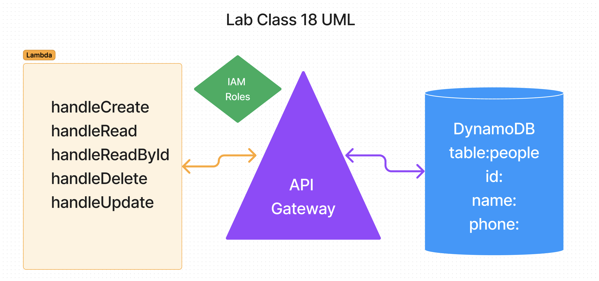

# AWS API-Gateway, Dynamo and Lambda

## Author: Eva Grace Smith

### Task

Create a serverless REST API.

### Requirements

Create a single resource REST API using a domain model, constructed using AWS Cloud Services.

### Database: DynamoDB
1 Table required.

### Routing: API Gateway

### UML

### What is the root URL to your API?
/people
### What are the routes?

Post:
/people/handlePost

Put:
/people/handleUpdate

Get:
/people/handleRead

Get by Id:
/people/handleReadById

Delete:
/people/handleDelete

### What inputs do they require? What output do they return?
POST:
* /people/handlePost- Given a JSON body, inserts a record into the database.
returns an object representing one record, by its id (##).

Put
* /people/handleUpdate -- Given a JSON body and an ID (##), updates a record in the database.

Get
* /people/handleRead -- returns an array of objects representing the records in the database.

Get by Id:
* /people/handleReadById -  - returns an object representing one record, by its id (##).

Delete:
* /people/handleDelete - - Given an id (##) removes the matching record from the database.
- returns an empty object.

### Deployment:

https://uau7669159.execute-api.us-east-1.amazonaws.com/beta/people

### Collaboration:

[Ryan Galloway](https://github.com/rkgallaway) - utilized code from class lecture
[Mark Smith](https://github.com/markmrsmith) - tutor
